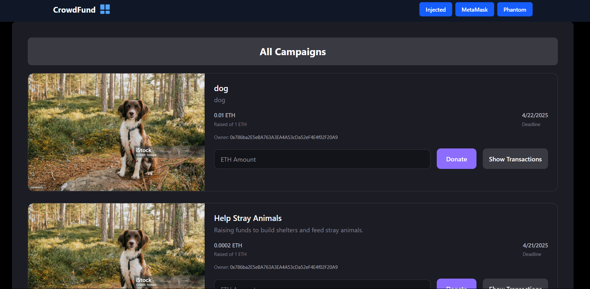
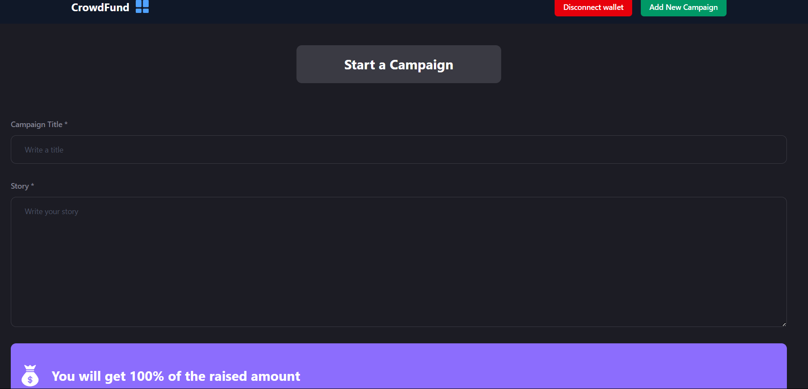
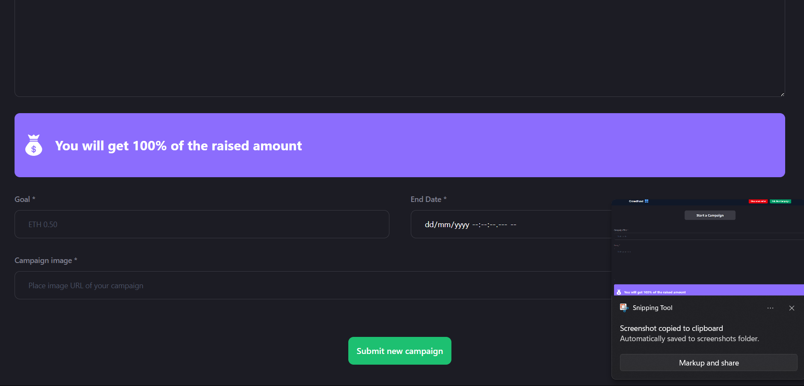

# Crowdfunding DApp

A decentralized crowdfunding platform built with Solidity smart contracts and React frontend, allowing users to create campaigns and receive donations directly on the blockchain.

## Features

- **Create Campaigns**: Users can create fundraising campaigns with title, description, target amount, deadline, and image
- **Donate to Campaigns**: Support campaigns by donating cryptocurrency directly to campaign owners
- **Real-time Updates**: View all active campaigns and their current funding status
- **Wallet Integration**: Connect your crypto wallet to interact with the platform
- **Transparent Donations**: All donations are recorded on the blockchain for transparency

## Tech Stack

### Smart Contract
- **Solidity** ^0.8.9
- **Ethereum** blockchain compatible
- **OpenZeppelin** standards

### Frontend
- **React** with modern hooks
- **Wagmi** for Ethereum interactions
- **TanStack Query** for data fetching
- **React Router** for navigation
- **CSS** for styling

## 📸 Screenshots

### Main Dashboard


### Create Campaign


### Campaign Details



*Note: If screenshots are not visible, please check that the image files exist in the `/screenshots` folder.*

## Smart Contract Architecture

### Main Contract: `Contract.sol`

#### Structs
```solidity
struct Campaign {
    address owner;          // Campaign creator's address
    string title;          // Campaign title
    string description;    // Campaign description
    uint256 target;        // Funding target amount
    uint256 deadline;      // Campaign deadline timestamp
    uint256 amountCollected; // Current amount raised
    string image;          // Campaign image URL
    address[] donators;    // Array of donor addresses
    uint256[] donations;   // Array of donation amounts
}
```

#### Key Functions
- `addCampaign()`: Create new fundraising campaigns
- `donateToCampaign()`: Donate to existing campaigns
- `getDonators()`: Retrieve campaign donors and amounts
- `getCampaigns()`: Get all campaigns data

## Installation & Setup

### Prerequisites
- Node.js (v16 or higher)
- npm or yarn
- MetaMask or compatible Web3 wallet
- Ethereum testnet ETH for testing

### Clone Repository
```bash
git clone <your-repository-url>
cd crowdfunding-dapp
```

### Smart Contract Deployment

1. Install Hardhat or Truffle for deployment
```bash
npm install --save-dev hardhat
```

2. Configure your deployment network in `hardhat.config.js`
```javascript
require("@nomicfoundation/hardhat-toolbox");

module.exports = {
  solidity: "0.8.9",
  networks: {
    sepolia: {
      url: "YOUR_SEPOLIA_RPC_URL",
      accounts: ["YOUR_PRIVATE_KEY"]
    }
  }
};
```

3. Deploy the contract
```bash
npx hardhat compile
npx hardhat run scripts/deploy.js --network sepolia
```

### Frontend Setup

1. Install dependencies
```bash
npm install
```

2. Update contract configuration in `src/config.js` with your deployed contract address
```javascript
export const CONTRACT_ADDRESS = "0x116DebaC086564330A8485FC5b09B1566BDB4145";
export const CONTRACT_ABI = [...]; // Your contract ABI
```

3. Start the development server
```bash
npm start
```

## Project Structure

```
crowdfunding-dapp/
├── contracts/
│   └── Contract.sol           # Main crowdfunding smart contract
├── screenshots/               # Application screenshots
│   ├── dashboard.png
│   ├── create-campaign.png
│   ├── campaign-details.png
│   └── donation-process.png
├── src/
│   ├── components/
│   │   ├── ConnectWallet.js   # Wallet connection component
│   │   ├── AddCampaign.js     # Campaign creation form
│   │   ├── CampaignList.js    # Display all campaigns
│   │   └── Navbar.js          # Navigation component
│   ├── config.js              # Web3 configuration
│   ├── App.js                 # Main application component
│   └── App.css               # Application styles
├── scripts/
│   └── deploy.js             # Contract deployment script
└── README.md
```

## Usage

### For Campaign Creators

1. **Connect Wallet**: Click "Connect Wallet" and approve the connection
2. **Create Campaign**: Navigate to "Add Campaign" and fill in:
   - Campaign title
   - Detailed description
   - Target funding amount (in ETH)
   - Campaign deadline
   - Campaign image URL
3. **Submit**: Confirm the transaction to create your campaign

### For Donors

1. **Browse Campaigns**: View all active campaigns on the homepage
2. **Select Campaign**: Click on a campaign to view details
3. **Donate**: Enter donation amount and confirm transaction
4. **Track**: Monitor campaign progress and your contributions

## Smart Contract Security Features

- **Deadline Validation**: Campaigns must have future deadlines
- **Active Campaign Check**: Donations only accepted before deadline
- **Automatic Transfer**: Funds sent directly to campaign owner
- **Failed Transfer Protection**: Reverts transaction if transfer fails
- **Public Transparency**: All campaign data publicly viewable

## Gas Optimization

- Efficient storage patterns
- Batch operations where possible
- Minimal external calls
- Optimized loops and data structures

## Testing

### Run Smart Contract Tests
```bash
npx hardhat test
```

### Run Frontend Tests
```bash
npm test
```

## Deployment

### Smart Contract
Deploy to mainnet or testnet using Hardhat:
```bash
npx hardhat run scripts/deploy.js --network mainnet
```

### Frontend
Build and deploy frontend:
```bash
npm run build
# Deploy build folder to your hosting service
```

## Contributing

1. Fork the repository
2. Create a feature branch (`git checkout -b feature/amazing-feature`)
3. Commit changes (`git commit -m 'Add amazing feature'`)
4. Push to branch (`git push origin feature/amazing-feature`)
5. Open a Pull Request

## Security Considerations

- Always test on testnets before mainnet deployment
- Conduct thorough smart contract audits
- Implement proper access controls
- Monitor for reentrancy attacks
- Use established security patterns

## License

This project is licensed under the MIT License - see the LICENSE file for details.

## Support

For questions and support:
- Create an issue in the repository
- Check existing documentation
- Review smart contract comments

## Roadmap

- [ ] Campaign categories and filtering
- [ ] Refund mechanism for failed campaigns
- [ ] Campaign update system
- [ ] Multi-token support
- [ ] Mobile app development
- [ ] Advanced analytics dashboard

---

**⚠️ Disclaimer**: This is educational software. Conduct proper security audits before using in production with real funds.
